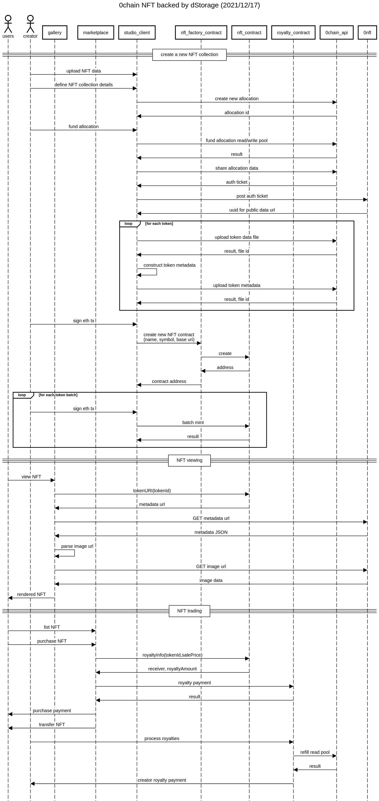

# 0Chain dStorage backed NFT API

### Components and legend

`studio client` - UI for creating NFTs  
`nft_factory_contract` - FactoryModuleERC721, FactoryModuleERC721Fixed, FactoryModuleERC721Random  
`nft_contract` - DStorageERC721, DStorageERC721Fixed, DStorageERC721Pack, DStorageERC721Random  
`royalty_contract` - is to handle routing for fee sharing  
`0chain_api` - blobber storage API  
`0nft` - is the service for exposing files on 0chain as a normal public url  
`auth ticker` - is the auth ticket generated on the 0chain side and passed to the 0nft service

### Current deployments

Network: **Rinkeby**

Factory: **0xD98602749e7f46036d496e8D3deb6eb9F90996a6**

## Create a new NFT collection

## NFT View

## NFT Trading

